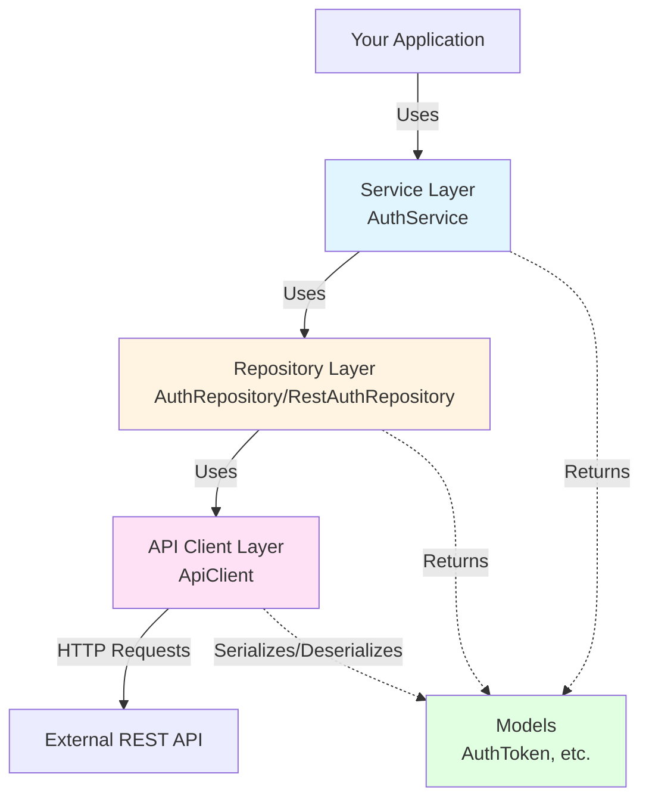
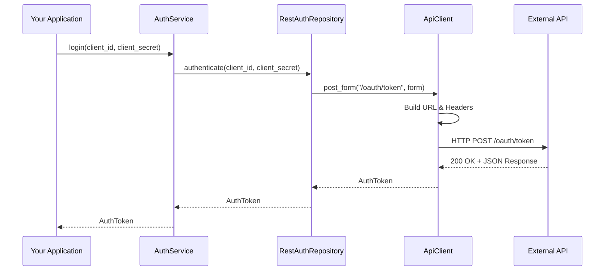

# Rust API Client

A reusable HTTP client library in Rust for simplifying REST API requests with authentication and token management support.

## 📋 Description

`rust-api-client` is a library that provides an abstraction over `reqwest` for making HTTP calls to REST APIs in a simple and structured way. It includes support for:

- GET, POST, PUT, and DELETE requests
- Bearer token authentication
- JSON and form-urlencoded data submission
- Layered architecture (API Client → Repository → Service)
- HTTP mock testing

## 🚀 Installation

### Prerequisites

- Rust 1.75 or higher (2024 edition)
- Cargo (included with Rust)

### Add as dependency

Add this library to your project in the `Cargo.toml` file:

```toml
[dependencies]
rust-api-client = { git = "https://github.com/LuigimonSoft/rust-api-client" }
```

Or if you have the project locally:

```toml
[dependencies]
rust-api-client = { path = "../rust-api-client" }
```

### Build the project

```bash
# Clone the repository
git clone https://github.com/LuigimonSoft/rust-api-client.git
cd rust-api-client

# Build
cargo build

# Build in release mode (optimized)
cargo build --release
```

### Run tests

```bash
# Run all tests
cargo test

# Run tests with detailed output
cargo test -- --nocapture
```

## 📖 Usage

### Basic ApiClient usage

```rust
use rust_api_client::api::ApiClient;
use serde::{Deserialize, Serialize};

#[derive(Serialize, Deserialize)]
struct User {
    id: u64,
    name: String,
    email: String,
}

#[tokio::main]
async fn main() -> Result<(), Box<dyn std::error::Error>> {
    // Create a client without authentication
    let client = ApiClient::new("https://api.example.com");

    // Make a GET request
    let user: User = client.get_json("/users/1", None).await?;
    println!("User: {}", user.name);

    Ok(())
}
```

### Using Bearer authentication

```rust
use rust_api_client::api::ApiClient;

#[tokio::main]
async fn main() -> Result<(), Box<dyn std::error::Error>> {
    // Create a client with authentication token
    let client = ApiClient::new("https://api.example.com")
        .with_token("your_token_here".to_string());

    // Requests will include the header: Authorization: Bearer your_token_here
    let data: serde_json::Value = client.get_json("/protected/resource", None).await?;

    Ok(())
}
```

### Sending data with POST (JSON)

```rust
use rust_api_client::api::ApiClient;
use serde::{Deserialize, Serialize};

#[derive(Serialize)]
struct CreateUser {
    name: String,
    email: String,
}

#[derive(Deserialize)]
struct UserResponse {
    id: u64,
    name: String,
}

#[tokio::main]
async fn main() -> Result<(), Box<dyn std::error::Error>> {
    let client = ApiClient::new("https://api.example.com");

    let new_user = CreateUser {
        name: "John Doe".to_string(),
        email: "john@example.com".to_string(),
    };

    let response: UserResponse = client
        .post_json("/users", &new_user, None)
        .await?;

    println!("User created with ID: {}", response.id);

    Ok(())
}
```

### Sending data with POST (Form-urlencoded)

```rust
use rust_api_client::api::ApiClient;
use serde::{Deserialize, Serialize};

#[derive(Serialize)]
struct LoginForm {
    username: String,
    password: String,
}

#[derive(Deserialize)]
struct LoginResponse {
    access_token: String,
}

#[tokio::main]
async fn main() -> Result<(), Box<dyn std::error::Error>> {
    let client = ApiClient::new("https://api.example.com");

    let credentials = LoginForm {
        username: "user".to_string(),
        password: "password".to_string(),
    };

    let response: LoginResponse = client
        .post_form("/auth/login", &credentials, None)
        .await?;

    println!("Token obtained: {}", response.access_token);

    Ok(())
}
```

### Using the integrated authentication system

```rust
use rust_api_client::service::AuthService;
use rust_api_client::repository::RestAuthRepository;

#[tokio::main]
async fn main() -> Result<(), Box<dyn std::error::Error>> {
    // Create the authentication repository
    let auth_repo = RestAuthRepository::new(
        "https://api.example.com",
        "/oauth/token"
    );

    // Create the authentication service
    let auth_service = AuthService::new(auth_repo);

    // Perform login
    let token = auth_service.login("client_id", "client_secret").await?;

    println!("Access token: {}", token.access_token);
    println!("Token type: {}", token.token_type);

    if let Some(expires_in) = token.expires_in {
        println!("Expires in: {} seconds", expires_in);
    }

    Ok(())
}
```

### Custom headers

```rust
use rust_api_client::api::ApiClient;

#[tokio::main]
async fn main() -> Result<(), Box<dyn std::error::Error>> {
    let client = ApiClient::new("https://api.example.com");

    // Add custom headers
    let custom_headers = [
        ("X-Custom-Header", "value"),
        ("X-API-Version", "v2"),
    ];

    let data: serde_json::Value = client
        .get_json("/api/data", Some(&custom_headers))
        .await?;

    Ok(())
}
```

### PUT and DELETE operations

```rust
use rust_api_client::api::ApiClient;
use serde::{Deserialize, Serialize};

#[derive(Serialize)]
struct UpdateUser {
    name: String,
}

#[derive(Deserialize)]
struct UserResponse {
    id: u64,
    name: String,
}

#[tokio::main]
async fn main() -> Result<(), Box<dyn std::error::Error>> {
    let client = ApiClient::new("https://api.example.com")
        .with_token("your_token".to_string());

    // Update a resource (PUT with JSON)
    let update = UpdateUser {
        name: "New Name".to_string(),
    };

    let updated: UserResponse = client
        .put_json("/users/1", &update, None)
        .await?;

    println!("User updated: {}", updated.name);

    // Delete a resource (DELETE)
    let deleted: serde_json::Value = client
        .delete_json("/users/1", None)
        .await?;

    println!("Resource deleted: {:?}", deleted);

    Ok(())
}
```

## 🏗️ Architecture

The library follows a layered architecture:



### Architecture Flow



### Main components

- **ApiClient**: Generic HTTP client with methods for GET, POST, PUT, DELETE
- **AuthRepository**: Trait and implementation for authentication
- **AuthService**: High-level service for authentication operations
- **Models**: Data structures (e.g., `AuthToken`)

## 🧪 Testing

The project includes unit and integration tests:

```bash
# Run all tests
cargo test

# Run specific tests
cargo test api_client_tests
cargo test auth_service_tests
cargo test auth_repository_tests
```

Tests use `httpmock` to simulate HTTP responses.

## 📦 Dependencies

- `tokio`: Asynchronous runtime
- `reqwest`: HTTP client
- `serde`: Serialization/deserialization
- `serde_json`: JSON support
- `async-trait`: Async traits

### Development dependencies

- `httpmock`: HTTP server mocking for testing

## 🤝 Contributing

Contributions are welcome. Please:

1. Fork the project
2. Create a feature branch (`git checkout -b feature/new-feature`)
3. Commit your changes (`git commit -am 'Add new feature'`)
4. Push to the branch (`git push origin feature/new-feature`)
5. Open a Pull Request

## 📄 License

This project is licensed under the MIT License. See the `LICENSE` file for more details.

## 👤 Author

**LuigimonSoft**

- GitHub: [@LuigimonSoft](https://github.com/LuigimonSoft)

## 🔗 Links

- [Rust Documentation](https://doc.rust-lang.org/)
- [Reqwest](https://docs.rs/reqwest/)
- [Tokio](https://tokio.rs/)

## SonarQube Quality Gate Status
[](https://sonarcloud.io/summary/new_code?id=LuigimonSoft_rust-api-client)

- Coverage: [](https://sonarcloud.io/summary/new_code?id=LuigimonSoft_rust-api-client)